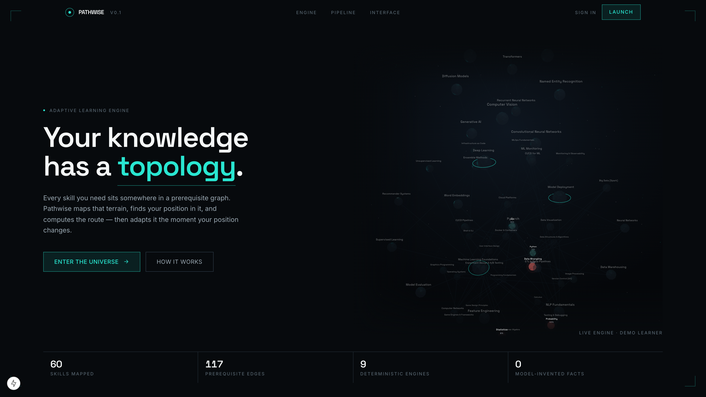
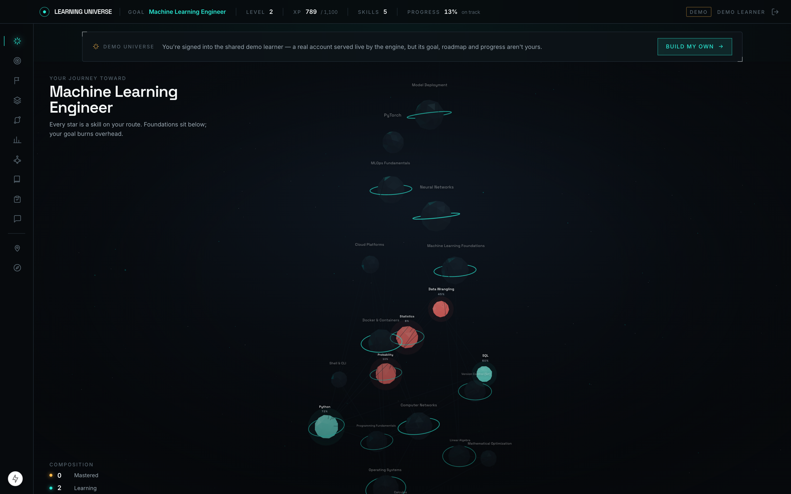
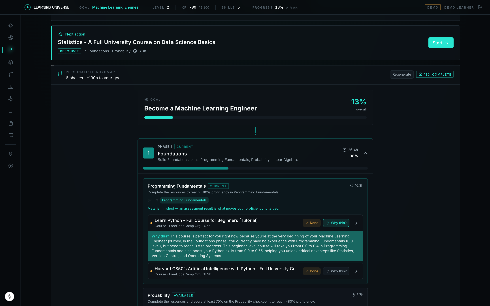
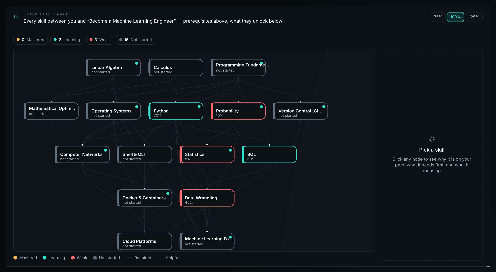
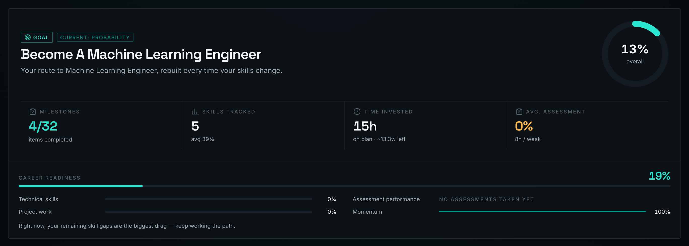
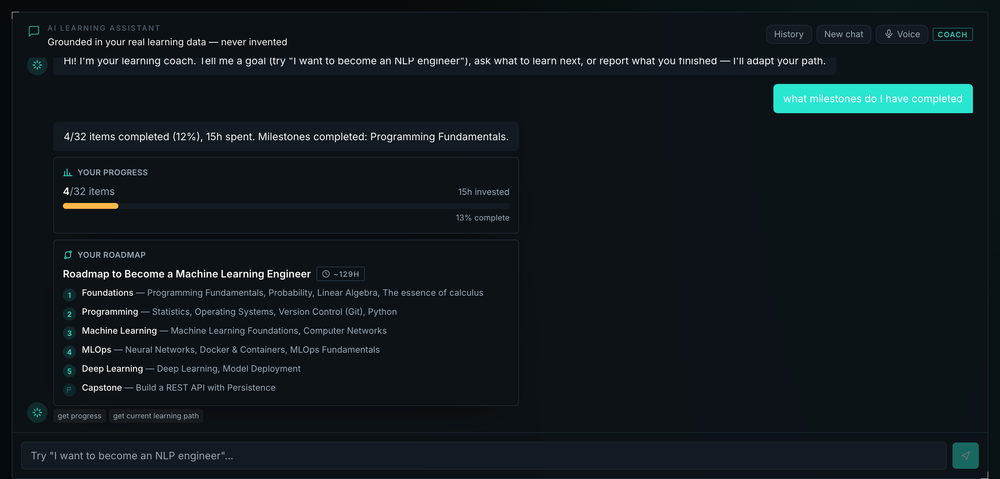

# Pathwise — the AI-Powered Learning Universe

**Tell it a goal in one sentence. It maps the terrain of skills between you and
that goal, plans the route, explains every step, and adapts the moment you
prove something — then renders the whole journey as an explorable 3D galaxy.**



A learner states a goal ("I want to become a machine learning engineer, I have
8 hours a week and I already know Python"). Pathwise extracts the profile,
computes the skill gap against a prerequisite graph, builds an ordered roadmap
over a catalogue of real YouTube courses, tracks progress as append-only
events, adapts as evidence arrives — and can explain every number it shows,
because every number has receipts.

The core design rule, visible everywhere in the code: **the deterministic
engine decides, the model only writes prose.** Everything with a right answer —
prerequisite ordering, gap size, resource ranking, grading, mastery, adaptive
branching — is pure Python in `backend/app/engines/`: no DB, no clock, no
network, no model, unit-testable and auditable. The LLM works only where
natural language is genuinely required, and both edges are fenced by validation
and a grounding check.

---

## The Learning Universe — a game-like 3D world



The dashboard doesn't open on a bar chart. It opens **inside a galaxy** — your
skill graph as a full-bleed, explorable 3D world built with three.js:

- **Altitude is prerequisite depth.** Foundations orbit at the bottom, your
  goal burns overhead — learning literally reads as *ascending*.
- **Mastery is the visual language.** Mastered skills burn amber, skills
  you're learning glow teal, weak ones pulse coral — and everything you
  haven't discovered yet sits dim and translucent in the **knowledge fog**,
  waiting to be charted.
- **Progression is game-like.** A status HUD carries your level, XP and pace.
  XP is *derived, never stored* (`lib/xp.ts`) — a pure function of completed
  items, proficiency and assessment results, so the number can never disagree
  with the work behind it. Goal skills are ringed landmarks; selecting a star
  eases the camera toward it, lights its full prerequisite route with charge
  packets travelling prerequisite → dependent, and dims everything else.
- **The AI coach drives the world.** When a coach reply names a skill, its
  star is selected and pulsed — "how comfortable are you with Linear Algebra?"
  physically points at Linear Algebra.
- **It's a projection, not a decoration.** The galaxy and the 2D knowledge
  graph render the same `GraphModel` — one source of truth, two views. Nothing
  appears in the universe that the engines and your data did not put there.

The landing page runs the **real engine**, not a mockup: its hero mounts the
same scene with the live demo learner's graph in ambient mode, and the
telemetry strip below it (60 skills, 117 prerequisite edges at the time of
this screenshot) is fetched from the backend, never hardcoded.

---

## Explainable AI — every number carries its receipts



Most recommenders answer *what*. Pathwise is built to answer ***why*** — and
to prove it isn't making the answer up:

- **"Why this?" on every roadmap item.** Each planned item persists a
  `rationale_trace` (which skill it serves, your level, the required level,
  the gap, its phase). Ask, and the backend assembles that evidence with your
  live proficiency records, Claude writes the prose — and a **grounding
  guard** (`engines/explanation/grounding.py`) rejects any output containing
  a percentage or skill-like phrase absent from the structured evidence. If
  the model invents, a deterministic template answers instead. The response
  is labelled `source: llm | template` and `grounded: true/false`.
- **"How do I know this number?"** Every proficiency figure links to its
  evidence: `GET /me/skills/{id}/evidence` returns the recorded entry, every
  assessment attempt that measured the skill, and every completed resource
  that taught it — the guard against blindly trusting self-report.
- **Ranking is auditable after the fact.** Recommendation and path items
  persist their full scoring trace (`rationale_trace`), so a past decision
  can be inspected long after the catalogue has changed.
- **The knowledge graph explains structure deterministically.** Why a skill
  is on your path, what it needs first, and what it unlocks are answered from
  the prerequisite DAG itself — graph queries, not generated text.



The same fencing applies everywhere a model touches the system — profiles
extracted from free text and generated assessment questions are validated
against Pydantic contracts before use; a malformed or unkeyed question is
rejected, never scored.

| The model does | The model never does |
|---|---|
| Extract a structured profile from free text | Decide a proficiency, gap or score |
| Judge the best courses from a vetted shortlist | Add a course the engine didn't approve |
| Rephrase a grounded explanation | Invent the facts it explains |
| Design a role's skill graph for unknown goals | Write a cycle into the DAG (checked, refused) |
| Write the coach's final reply | Choose which application data to fetch |

---

## The Adaptive Learning Engine



The pipeline that turns "one sentence of ambition" into a living plan:

```
profile + goal
   → skill_gap/analyzer      what is missing, in prerequisite order
   → search (pgvector)       candidate resources, semantically retrieved
   → recommendation/scoring  weighted hybrid rank + readiness gate
   → path/generator          phased roadmap with a schedule
   → explanation             rationale, grounded against the evidence
```

- **Prerequisites always come first.** Gaps are not sorted by size — a
  priority-aware topological sort guarantees a prerequisite precedes whatever
  depends on it, in every phase.
- **The readiness gate.** A resource whose prerequisites you don't meet is
  demoted or excluded, so recommendations match your current stage rather
  than mere popularity. Introductory material (difficulty 1–2) is never gated.
- **Adaptation on evidence, stability otherwise.** Assessment results feed
  fixed threshold bands (`engines/adaptive/decisions.py`): a strong score
  completes the milestone and unlocks the next; a weak one inserts targeted
  remediation. Routine completions never mutate the plan — *once the roadmap
  is formed, only hard evidence reshapes it.* And running out of actionable
  material always opens the next milestone, so the path can never dead-end.
- **Progress is event-sourced.** `user_progress` is append-only; every
  summary, pace forecast and completion percentage is derived from it. Career
  readiness (`GET /readiness`) composes the evidence that already exists —
  dimensions with no evidence are reported *missing*, never counted as zero.
- **The graph grows to meet the goal.** A goal the catalogue can't name
  ("devops engineer") is not a dead end: Claude designs the role's
  required-skill graph, deterministic code materialises it through the
  cycle-checked graph API, and a second learner with the same goal converges
  on the same graph. Skills nothing teaches trigger the catalogue pipeline to
  discover real courses — an LLM judge picks the best from an
  engine-vetted shortlist, and can only choose among candidates the pure
  selector already approved.

---

## The AI coach — with a voice



`services/chat_service.py` is deterministic control flow around a generative
step:

```
message → detect intent (rule-based regex) → select tools → run tools (real services)
        → compose grounded reply → optional LLM rephrase (grounded) → persist turn
```

The model never decides what to fetch. Every turn is also scanned for a time
budget and claimed skills ("I want to be an ML engineer, I have an hour a day
and I already know Python" is all three at once) — self-report fills blanks
but never overwrites assessment evidence. Conversation memory and application
state are strictly separate: the messages table stores dialogue only, every
fact is re-fetched through one of eleven tools each turn, and each reply shows
which tools ran (the chips under the answer above).

**The voice agent** wraps the same pipeline without altering it:

```
speak → speech-to-text → (the unchanged /chat pipeline) → reply → text-to-speech
```

- A spoken turn calls exactly the same `send` as a typed one — intent engine,
  tools and grounding are identical, so the two modes cannot drift apart.
- **Barge-in:** speaking over a reply cancels it (and stops the microphone
  hearing the synthesiser).
- **Replies are rewritten for the ear:** "85%" is spoken as "85 percent",
  "1 skill(s)" as "1 skill", URLs become "the link on screen".
- **Zero-config:** speech runs on the browser's own Web Speech API — no key,
  no backend route. The seam (`lib/voice/speech.ts`) is deliberately narrow
  so a server-side Whisper/TTS provider can replace it without touching the
  UI. A browser without speech support keeps text chat and says so; the UI
  states before opening the microphone that browser speech recognition
  streams audio to the browser vendor's service.

---

## Specification

**Backend** — FastAPI · Pydantic v2 · SQLAlchemy 2.0 (async, asyncpg) ·
PostgreSQL 16 + pgvector · Alembic · Redis (shared query-embedding cache) ·
Docker Compose

**Frontend** — Next.js 15 (App Router) · React 19 · TypeScript · Tailwind ·
Recharts · Three.js (react-three-fiber) · Inter + Space Grotesk

**Models** — LLM provider is `mock | claude | openai`, embeddings are
`mock | openai | sentence_transformer`, both chosen from settings and never
hard-coded in callers. Everything defaults to `mock`, so the whole stack runs
in dev and CI with **no API key and no torch**. One substitution:
`LLM_PROVIDER=openai` with no `OPENAI_API_KEY` uses Claude instead when an
`ANTHROPIC_API_KEY` is set — logged, and `/health` reports the provider
actually answering.

**Layering** — routers hold HTTP only; services own business rules and the
transaction boundary; repositories query and flush but never commit; `engines/`
is pure decision logic depending on plain data alone. Errors render as
RFC 7807 `application/problem+json`. Ownership is checked as a 404, not a 403,
so a non-owner cannot probe which ids exist.

```
routers/  →  services/  →  repositories/  →  models/ + db/
engines/      pure decision logic — called by services, depends on nothing
llm/          provider-agnostic transport + structured-output contracts
embeddings/   provider-agnostic vectors + query cache
catalogue/    provider-agnostic course discovery (none | scrape | youtube)
```

**Data** — 21 tables across identity, skill taxonomy (DAG with cycle-checked
edges), goals, catalogue, paths, assessments, progress events and
conversations. `skills.embedding` / `resources.embedding` are pgvector
columns. The seeded graph (12 categories, 56 skills, 83 edges, ~90 verified
YouTube courses with real runtimes) grows at runtime as role graphs and
catalogue discovery add to it.

**API** — ~60 endpoints under `/api/v1` covering auth, profiles, the skill
graph, goals, resources, semantic search, gap analysis, path generation,
assessments, adaptive updates, progress, recommendations (with per-item
explanations), readiness, career discovery and chat. Interactive docs at
`/docs`.

**Dashboard** — ten sections: Learning Universe, Overview, Current Mission,
Roadmap, Learning Path, Skill Progress, Knowledge Graph, Recommended,
Assessments, AI Coach.

---

## Setup

### Quick start — Docker

```bash
docker compose up
```

Builds the API image, waits for Postgres, runs migrations, seeds the skill
graph, catalogue, bootstrap admin **and the demo learner**, and serves on
<http://localhost:8000> (docs at `/docs`, health at `/health`). Compose runs
the backend only; start the frontend separately (below). If ports 5432 / 6379
/ 8000 are taken, copy `.env.example` to `.env` at the repo root and change
the host-side mappings.

### Frontend

```bash
cd frontend && npm install
BACKEND_URL=http://localhost:8000 npm run dev
```

Serves on <http://localhost:3000>. `next.config.ts` rewrites `/api/*` to the
backend, so the browser stays same-origin. There is **no bundled fake data
anywhere**: `/dashboard?demo=1` signs into the seeded demo learner
(`demo@example.com` / `demo-universe` — configurable via
`DEMO_LEARNER_EMAIL/_PASSWORD`, empty email disables it), a real account whose
journey was generated by the actual engines, served live like any other user.
The landing hero fetches the same account's universe through the
unauthenticated read-only `GET /public/demo/universe`.

### Local backend (no Docker for the API)

```bash
cd backend && python3.12 -m venv .venv && .venv/bin/pip install -r requirements-dev.txt
cp .env.example .env
docker compose up -d postgres redis
.venv/bin/alembic upgrade head && .venv/bin/python -m app.db.seed
.venv/bin/uvicorn app.main:app --reload
```

Python 3.12 is required (3.13+ lacks wheels for some pinned dependencies).
For real local embeddings install `requirements-embeddings.txt` (pulls torch)
and set `EMBEDDING_PROVIDER=sentence_transformer`.

### Providers (all optional — everything runs without keys)

| What | Setting | Effect |
|---|---|---|
| Claude as LLM | `ANTHROPIC_API_KEY` + `LLM_PROVIDER=claude` | Coach replies, explanations, role-graph design, course judging |
| OpenAI for both halves | `OPENAI_API_KEY` + `./scripts/use-openai.sh` | LLM + real semantic embeddings (re-embeds the catalogue) |
| Course discovery | `CATALOGUE_PROVIDER=youtube` + `YOUTUBE_API_KEY` | Real search metadata; only this provider may deactivate dead links (it can *prove* absence). `scrape` works keyless but is rate-limited; `none` (default) stays offline |

Credentials are validated lazily — an unconfigured provider fails at call time
with a clear message, never at boot. Keys live in `backend/.env` (gitignored)
and are passed through the environment, never baked into images.

### Tests

```bash
cd backend && .venv/bin/python -m pytest
```

410 tests across ~30 files. Engine tests need no database at all (everything
in `app/engines/` is pure); API tests run in-process against the real database
and skip themselves if none is reachable.

---

## The catalogue pipeline

Seeding covers what is curated; the pipeline covers what is not — and answers
a question nothing else can: *is that video still there?*

```bash
# nightly — deactivate resources whose video is gone or now private
python -m scripts.catalogue_pipeline health

# weekly — find real content for skills nothing teaches (plan first, then spend)
python -m scripts.catalogue_pipeline gaps --dry-run
python -m scripts.catalogue_pipeline gaps --yes
```

Selection is agentic with a validated floor: a pure engine filters raw search
results (teasers, career-advice noise, wrong language, one pick per channel),
and the configured model judges the best of that shortlist — it can only
choose among candidates the engine already approved. Only a provider that can
**prove absence** (the authenticated API) may take a resource offline; the
scraper's "unavailable" is indistinguishable from throttling and is never
acted on. Recovery is unrestricted in the other direction.

---

## Project layout

```
backend/
  app/
    engines/        pure decision logic: skill_graph, skill_gap, recommendation,
                    path, adaptive, assessment, explanation (+ grounding), chat,
                    catalogue, readiness, discovery, profile, progress
    services/       business rules & transactions (30+ modules)
    routers/        HTTP only            repositories/   data access
    llm/            providers + contracts  embeddings/   vectors + cache
    catalogue/      discovery providers    db/seeds/     declarative graph + catalogue
  scripts/          catalogue_pipeline, refresh_catalogue, gen_seed
  tests/            engines tested without a DB
frontend/
  src/
    app/            landing, /login, /signup, /onboarding, /dashboard
    components/     dashboard (universe, roadmap, graph, chat…), landing, ui
    lib/            typed API layer, voice (STT/TTS), graph/universe layout,
                    derive (API → view model), hooks
docs/screenshots/   the images in this README, captured from the running app
```


## Design guarantees that used to be limits

- **No model, no invented facts — ever.** With `LLM_PROVIDER=mock`, open
  subject-matter questions ("CNNs vs transformers?") are answered from the
  catalogue's own stored course descriptions — curated facts, not guesses —
  and the coach says plainly when that is all it has. A configured model adds
  fluency, never new authority.
- **Reviewer grading replays the full pipeline.** Marking a short answer
  correct doesn't stop at re-scoring: the proficiency the submission blended
  in is recovered exactly (the update is a linear formula, so it inverts) and
  re-applied with the reviewed score, and the adaptive engine re-runs its
  threshold decisions — a milestone earned by the corrected score unlocks
  then, not never.
- **Declared prior courses match carefully, then stop.** Beyond id, URL and
  exact-title matches, a guarded token tier resolves human shorthand ("CS50
  Python" → the Harvard course) — but only when every identity token appears,
  exactly one candidate qualifies, and no stated provider disagrees. Anything
  weaker shows the course again rather than hiding one the learner never took.
- **Feedback lands where it was given.** A thumbs-down on a specific resource
  demotes exactly that resource in ranking (your latest signal wins); the
  per-provider average remains only as the prior for material you have never
  rated.
